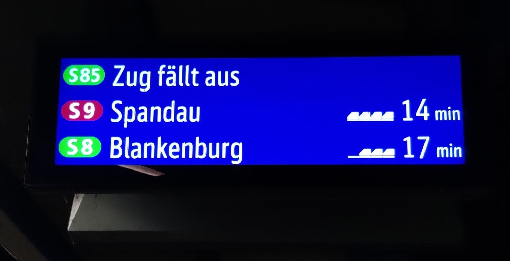

= S85.berlin

Monday, 7pm. The weather is bad, your day wasn't really great and you just want to get home. So you quickly go to https://en.wikipedia.org/wiki/Berlin_Treptower_Park_station[Treptower Park station] just to see this?

Well, this happens a lot. (Sometimes due to understandable reasons and sometimes because... yes?) +
That's why https://s85.berlin[s85.berlin] exists.

This Golang application gets data from https://transport.rest[transport.rest] every minute to check whether the most-important(TM) sub-urban railway line of Berlin https://sbahn.berlin/en/plan-a-journey/s85/[S85] is running or not and is displaying it on a simple webpage. +
The station data of https://en.wikipedia.org/wiki/Baumschulenweg_station[Baumschulenweg station] is used to have the best result.

=== ToDo

* [x] multi-language support (PRs with other languages still welcome!)
* [ ] save requested data to a database
* [ ] dashboard to see availability of S85 over time
* [ ] add buttons to share status on Social Media (e.g. X)
* [ ] more responsive web-"design"
* [ ] create a bot to automatically update status updates on X/Mastodon/...
* [ ] check multiple stations during construction work (e.g. when S85 is not running via Baumschulenweg)